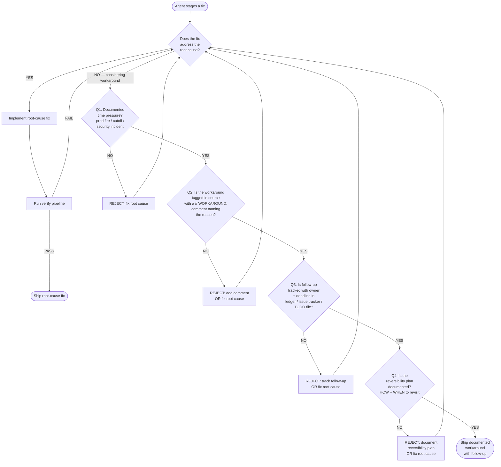

# Decision tree — workaround vs root cause

When the agent is staging a fix and notices any workaround-shaped pattern (typographical evasion, error suppression, scope-narrowing escape, hardcoded sentinel, test skip — see [`anti-pattern-catalog.md`](anti-pattern-catalog.md)), this flowchart determines whether the workaround is acceptable or rejected.

The flowchart is provided in two equivalent forms:

1. **Mermaid** — for renderers that support mermaid syntax (GitHub, VS Code with the mermaid plugin, Obsidian).
2. **Plain-text fallback** — for terminals, grep, and renderers without mermaid support.

Both forms encode the same 4-question gate. They MUST stay in sync; a divergence is itself a workaround pattern (different rules render to different audiences).

## Mermaid flowchart



## Plain-text fallback

```
[Agent stages a fix]
        |
        v
   Does the fix address the root cause?
        |
        +-- YES --> Implement root-cause fix
        |              |
        |              v
        |         Run verify pipeline
        |              |
        |              +-- PASS --> Ship root-cause fix
        |              |
        |              +-- FAIL --> back to root-cause question
        |
        +-- NO (considering workaround) --> Q1
                                            |
                                            v
   Q1. Documented time pressure?
       (prod fire, demo cutoff, security incident)
        |
        +-- NO  --> REJECT: fix root cause (loop back)
        |
        +-- YES --> Q2
                    |
                    v
   Q2. Workaround tagged in source with a `// WORKAROUND:`
       comment naming the reason?
        |
        +-- NO  --> REJECT: add comment OR fix root cause (loop back)
        |
        +-- YES --> Q3
                    |
                    v
   Q3. Follow-up tracked with owner + deadline?
       (ledger / issue tracker / TODO file)
        |
        +-- NO  --> REJECT: track follow-up OR fix root cause (loop back)
        |
        +-- YES --> Q4
                    |
                    v
   Q4. Reversibility plan documented?
       (HOW to remove the workaround AND WHEN to revisit)
        |
        +-- NO  --> REJECT: document plan OR fix root cause (loop back)
        |
        +-- YES --> Ship documented workaround with follow-up
```

## Gate interpretation rules

- **All four answers must be YES** for a workaround to ship. Three-out-of-four is a rejection.
- **The gate is intentionally strict.** It is cheaper to spend 30 minutes finding the root cause than to ship a workaround that becomes permanent debt.
- **The gate is asymmetric.** A `YES` chain produces a documented workaround; any `NO` produces a root-cause fix. There is no "ship workaround silently" branch — that path is dead.
- **The loop-back is mandatory.** A REJECT outcome is not "give up"; it is "go back to the root-cause question and try again." Repeated rejections may surface that the spec itself is wrong — escalate to operator.

## Operator override

The operator may override the gate explicitly with the phrase "ship the workaround anyway, on my authority." This override:

- Must be explicit and from the operator (not a sub-agent or peer).
- Must be logged in the commit message body OR the PR description.
- Does NOT exempt the workaround from the `// WORKAROUND:` comment, follow-up tracker, or reversibility plan — the override only relaxes Q1 (time pressure documentation), not Q2/Q3/Q4.
- Counts toward a per-quarter override budget (suggested: ≤3 per quarter; more than that signals systemic debt). The budget is operator-tracked, not skill-enforced.

## Worked examples

### Example A — REJECT (typographical evasion)

```
Situation: Verify check `grep -c "copyfrom.sql.go" docs/PLAN.md` expects 0 matches.
Agent's draft fix: rename the string in the doc to "copyfrom_sql_go" so grep returns 0.
Q1: Is there time pressure? — NO (regular SDLC turn, no prod fire).
Outcome: REJECT at Q1. Root-cause fix is to remove the actual `copyfrom.sql.go`
reference reason from the doc OR update the grep rule with a one-line exception
comment.
```

### Example B — REJECT (suppressed error without diagnosis)

```
Situation: `kubectl get pods` returns nonzero exit on a transient ImagePullBackOff;
agent considers `kubectl get pods 2>/dev/null || true` to keep the pipeline green.
Q1: Time pressure? — NO (CI run can be retried).
Outcome: REJECT at Q1. Root-cause fix is to investigate the ImagePullBackOff
(image tag, registry credentials, network) and fix the underlying cause.
```

### Example C — ACCEPT (documented hotfix during prod fire)

```
Situation: 02:00 prod outage, billing service crash-loop. Fix-forward needs 2hr;
fix-back needs 30min. Agent ships the fix-back as a workaround.
Q1: Time pressure? — YES (prod outage, revenue impact, on-call escalation).
Q2: Comment? — YES, source tagged `// WORKAROUND: revert to legacy billing path
   to stop crash-loop — see ISSUE-501`.
Q3: Tracker? — YES, ISSUE-501 owns the fix-forward, criznguyen owner, deadline
   2026-05-11 (one week SLA).
Q4: Reversibility? — YES, ISSUE-501 description names the lines to revert + the
   integration test that must pass before re-enabling fix-forward.
Outcome: ACCEPT. Workaround ships with all four anchors.
```

## Composition

- This decision tree is consulted by the agent during fix authoring.
- The auditor (composing with `core/audit/`) uses [`anti-pattern-catalog.md`](anti-pattern-catalog.md) as the per-anti-pattern checklist; that catalog cross-references this tree for the gate.
- The reviewer (composing with `core/delta-code-review/`) uses [`workaround-template.md`](workaround-template.md) to validate that any `// WORKAROUND:` comment in the diff has all required fields.

## Maintenance

If a sixth recurring anti-pattern emerges (current 5 cover all observed incidents through 2026-05-04), update both the mermaid AND the plain-text fallback in this file in the same commit; the test-shape script will fail if mermaid drifts from plaintext.
